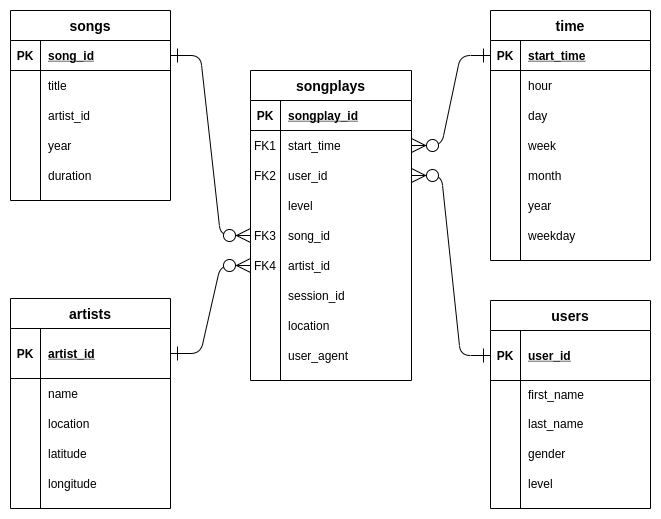

### Data Engineering Nanodegree Program

## PROJECT 1: DATA MODELING with POSTGRES

#### DATABASE PURPOSE

The Sparkify starup created a new music streaming application. In an effort 
to make this application more effective, Spyrkify's analytics team collected 
information about user activity and music listened to. All information is 
stored as JSON log files and JSON metadata files. The format of the data and 
its large volume makes direct analysis difficult. In this regard, it was 
decided to involve a data engineer to create a PostgreSQL specific schema 
designed database with the purpose to optimize queries.

#### SCHEMA DESIGN
 
As a data engineer I am agree with the _star schema design_ that includes
one Fact Table and four Dimension Tables.

1. The Fact Table is songplays table.
2. Dimension Tables are users, songs, artists, time tables.

 

Using the song and log datasets a star schema optimized for queries on song 
play analysis.

#### DATABASE and TABLES CREATION
    
The create_tables.py and DROP and CREATE queries of the 
sql_queries.py script are completed to create "sparkifydb" database with songplays,
users, songs, artists, time tables. The running of create_tables.py have to be done.

The running test.ipynb is recommended after running create_tables.py 
to confirm the creation of the tables with the correct columns.

#### ETL PROCESS

To develop ETL processes for each table was recommended the following to 
instruction in the etl.ipynb notebook and running test.ipynb at the end of each section
to confirm that tables were successfully filled. Also was recommended 
"to rerun create_tables.py to reset your tables before each time you run this notebook".

The pincipal part of the ETL development is the etl.py script.
The etl.ipynb and test.ipynb scripts are auxiliary. They are designed only for using by 
for the data engineer during project development.

The etl.py facilitates the processing of the entire datasets.
It reads files from song_data and log_data JSON files and loads them into 
corresponding tables. 
To complete etl.py development the INSERT queries and SELECT finding songs query
of the sql_queries.py are filled.

#### DATABASE QUERIES examples

Here are some examples of the queries that can be used by starup analytical team to
analyze the complete dataset. They are simple and clear. They can used because
created database and ETL pipline have been developed with the goal to optimize 
analytics.

For example,
 - SELECT count(song_id) FROM songs
 - SELECT count(user_id) FROM users
 - SELECT count(level) FROM users
